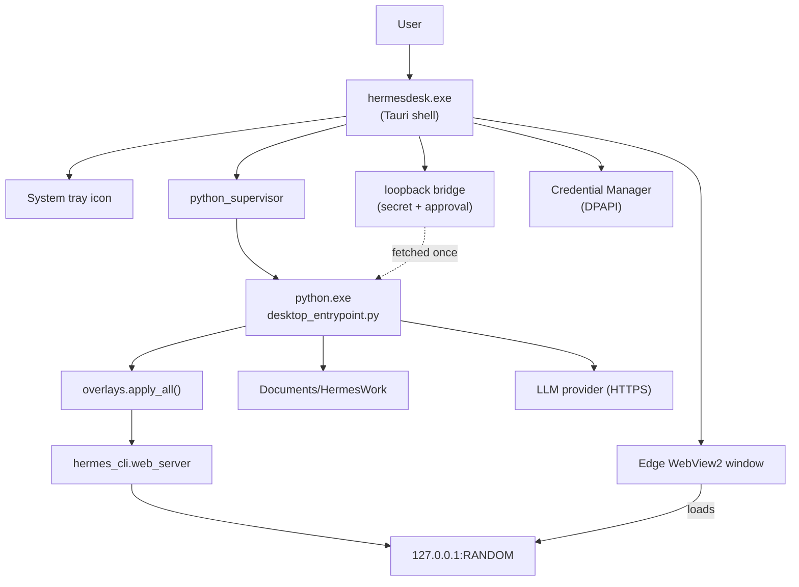

# HermesDesk architecture

## One-paragraph summary

HermesDesk is a thin Windows-native wrapper around the open-source
[Hermes Agent](https://github.com/NousResearch/hermes-agent). A Tauri 2
shell (Rust + WebView2) supervises an embedded Python 3.11 process that
runs a stripped, sandboxed Hermes core. The user sees a single chat
window. The Python child serves Hermes' own React UI on a random
loopback port; the Tauri shell loads it in WebView2. All API keys live
in Windows Credential Manager (DPAPI), all file ops are jailed to a
single workspace folder, and all dangerous tools are off by default.

## Process model




## Key files


| File                                                                    | Role                                                                                  |
| ----------------------------------------------------------------------- | ------------------------------------------------------------------------------------- |
| [tauri/src/lib.rs](../tauri/src/lib.rs)                                 | Wires plugins, spawns supervisor + bridge, points the WebView at Python               |
| [tauri/src/python_supervisor.rs](../tauri/src/python_supervisor.rs)     | Spawns and supervises `python.exe`, waits for port handshake                          |
| [tauri/src/bridge.rs](../tauri/src/bridge.rs)                           | Loopback HTTP for one-shot secret handoff and shell approval                          |
| [tauri/src/secrets.rs](../tauri/src/secrets.rs)                         | Provider config + DPAPI-backed key storage                                            |
| [tauri/src/paths.rs](../tauri/src/paths.rs)                             | Workspace + bundle + data dir resolution; settings                                    |
| [tauri/src/tray.rs](../tauri/src/tray.rs)                               | System tray + menu                                                                    |
| [python/src/desktop_entrypoint.py](../python/src/desktop_entrypoint.py) | Python entry — installs overlays, picks port, boots Hermes                            |
| [python/overlays/](../python/overlays/)                                 | Runtime patches for Hermes (jail, approval, secret, allowlist, toolset, posix safety) |
| [web/src/onboarding/](../web/src/onboarding/)                           | 5-step zero-jargon wizard                                                             |
| [web/src/advanced/Settings.tsx](../web/src/advanced/Settings.tsx)       | Power-user toggle, sign out, status                                                   |


## Startup sequence

```
T+0ms    user double-clicks Start Menu icon
T+50ms   hermesdesk.exe loads, splash window hidden until ready
T+100ms  Tauri runs setup(): installs tray, spawns bootstrap()
T+150ms  bootstrap(): ensure_workspace, resolve_runtime_dir, ensure_data_dir
T+200ms  bridge.spawn() picks a free loopback port, generates two tokens
T+250ms  python_supervisor::Supervisor::spawn() starts python.exe
T+500ms  Python: overlays.apply_all() installs jail/allowlist/etc
T+700ms  Python: free_port() picks an unused TCP port, writes port.txt
T+750ms  Python: hermes_cli.web_server.run(host=127.0.0.1, port=N) boots
T+800ms  Tauri: wait_for_port() reads port.txt, gets N
T+850ms  Tauri: window.eval window.location.replace("http://127.0.0.1:N/")
T+900ms  WebView2 loads the Hermes UI; Splash sees has_secret -> chat
```

## Failure modes

- **Python won't start:** `wait_for_port()` times out at 30s; we show a
Tauri dialog with the last 50 lines of `hermesdesk.log` and a "Reopen"
button.
- **No API key set:** Splash sees `has_secret == false` and routes to
`/onboarding/welcome`.
- **Provider rejects key:** Onboarding `validateKey` shows a friendly
message before saving — the key never leaves the WebView until the
provider's `/v1/models` (or equivalent) returns 200.
- **Workspace path no longer exists:** `ensure_workspace` recreates it
on launch.
- **Network unreachable:** Updater silently no-ops; chat shows the
provider's own error in-line.

## Why not Electron / why not pure browser?

- **Electron** would add ~120 MB just for Chromium when we already have
WebView2 on every supported Windows. Tauri's installer is ~15 MB and
uses the system WebView2.
- **Pure browser tab** loses the system tray, the OS-native dialogs we
use for shell approval, the DPAPI vault integration, and the "feels
like an app" experience. Non-pros routinely close browser tabs by
accident.

## Why not just `pip install` and a `.bat` file?

- Non-pros don't have Python.
- They don't have a Python they want to "share" with our tool.
- They don't read READMEs.
- A `.msi` is the one install pattern Windows users universally know.

