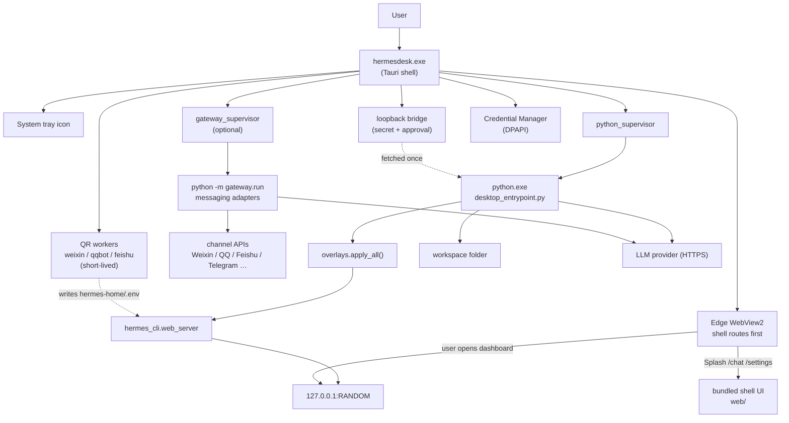

# HermesDesk architecture

## One-paragraph summary

HermesDesk is a thin Windows-native wrapper around the open-source
[Hermes Agent](https://github.com/NousResearch/hermes-agent). A Tauri 2
shell (Rust + WebView2) supervises **one long-lived embedded Python 3.11
process** (`desktop_entrypoint.py`) that runs a stripped, sandboxed Hermes
core (`hermes_cli.web_server` on loopback). The WebView2 window **starts on
the Tauri-hosted shell** (`web/` — Splash, onboarding, `/chat`, Settings); when the user opens the full console, the same webview navigates to Hermes’ React UI at `http://127.0.0.1:RANDOM`. Optionally, Tauri supervises a **second** Python child (`python -m gateway.run`) for messaging adapters when credentials exist under `hermes-home/.env`. Short-lived QR/token helper scripts may run as extra Python children during onboarding. LLM provider keys live in Windows Credential Manager (DPAPI); Hermes config is redirected to **`HERMES_HOME`** inside the app data dir (see `desktop_entrypoint.py`). File ops are jailed to a workspace folder and risky tools stay off until **power user** mode.

## Process model



### Strip shims vs real gateway code

The **Hermes web child** installs `strip_shims` so imports like `gateway.run.main` inside `web_server` load **no-op stubs** — the dashboard process must not accidentally become the messaging gateway entrypoint. The **`gateway/` tree still ships on disk** inside the bundle; the **gateway supervisor** runs **`python -m gateway.run`** as a **separate OS process**, which loads the real `gateway.run` module. See [python/overlays/strip_shims.py](../python/overlays/strip_shims.py).

### Shell chat (`/chat`)

The shell chat page calls Tauri **`invoke`** commands implemented in [tauri/src/chat.rs](../tauri/src/chat.rs). Rust proxies HTTP to the embedded Hermes loopback using **`X-HermesDesk-Auth`** plus the same **`Authorization: Bearer`** session token Hermes uses for its web UI (read from disk or scraped once from `index.html`). This avoids cross-origin `fetch` from the shell origin and keeps token handling in-process.

### Messaging gateway

- **Supervisor:** [tauri/src/gateway_supervisor.rs](../tauri/src/gateway_supervisor.rs) — eligibility from `hermes-home/.env`, spawn env, diagnostics (`gateway_state.json`, log tail).
- **Credentials UX:** Settings + onboarding blocks call Rust commands (`weixin_qr`, `qqbot_qr`, `feishu_qr`, `telegram_*`, `pairing_*`). Desk-tested flows cover **Weixin**, **QQ Bot**, **Feishu/Lark**, and **Telegram** (token).
- **LLM key for bots:** Gateway children reuse the desk **`secret_loader`** path so adapters call the configured model without a second vault UI.

Further product notes: [gateway-desk-weixin-strategy.md](gateway-desk-weixin-strategy.md), [gateway-route-c-weixin-validation.md](gateway-route-c-weixin-validation.md).


## Key files


| File                                                                    | Role                                                                                  |
| ----------------------------------------------------------------------- | ------------------------------------------------------------------------------------- |
| [tauri/src/lib.rs](../tauri/src/lib.rs)                                 | Plugins, `bootstrap`, gateway commands, Hermes respawn, dashboard URL helpers          |
| [tauri/src/python_supervisor.rs](../tauri/src/python_supervisor.rs)     | Spawns and supervises `desktop_entrypoint.py`, waits for port handshake               |
| [tauri/src/gateway_supervisor.rs](../tauri/src/gateway_supervisor.rs)   | Optional `gateway.run` child, `.env` eligibility, startup diagnostics                  |
| [tauri/src/chat.rs](../tauri/src/chat.rs)                               | Shell `/chat` → loopback Hermes HTTP proxy (`invoke` + bearer resolution)               |
| [tauri/src/bridge.rs](../tauri/src/bridge.rs)                           | Loopback HTTP for one-shot secret handoff and shell approval                          |
| [tauri/src/secrets.rs](../tauri/src/secrets.rs)                         | Provider config + DPAPI-backed key storage                                            |
| [tauri/src/paths.rs](../tauri/src/paths.rs)                             | Workspace + bundle + data dir resolution; settings                                    |
| [tauri/src/tray.rs](../tauri/src/tray.rs)                               | System tray + menu                                                                    |
| [python/src/desktop_entrypoint.py](../python/src/desktop_entrypoint.py) | Python entry — overlays, port handshake, boots Hermes web_server                       |
| [python/overlays/](../python/overlays/)                                 | Runtime patches (jail, approval, secret, allowlist, toolset, strip_shims, …)           |
| [web/src/main.tsx](../web/src/main.tsx)                                 | Shell router: Splash, onboarding, `/chat`, `/settings`                               |
| [web/src/onboarding/](../web/src/onboarding/)                           | Wizard + gateway/setup sections                                                       |
| [web/src/advanced/Settings.tsx](../web/src/advanced/Settings.tsx)       | Power user, gateway controls, Telegram/Feishu/QQ/Weixin blocks, proxy               |


## Startup sequence

```
T+0ms    user double-clicks Start Menu icon
T+50ms   hermesdesk.exe loads (window shown after bootstrap completes)
T+100ms  Tauri runs setup(): installs tray, spawns bootstrap()
T+150ms  bootstrap(): ensure_workspace, resolve_runtime_dir, ensure_data_dir
T+200ms  bridge.spawn() picks a free loopback port, generates tokens
T+250ms  python_supervisor::Supervisor::spawn() starts desktop_entrypoint.py
T+500ms  Python: overlays.apply_all()
T+700ms  Python: picks unused TCP port, writes port.txt
T+750ms  Python: hermes_cli.web_server.run(host=127.0.0.1, port=N)
T+800ms  Tauri: wait_for_port() reads port.txt → stores N (Hermes dashboard URL base)
T+820ms  If auto-start gateway enabled and .env has messaging keys → gateway_supervisor spawns gateway.run
T+850ms  WebView stays on Tauri shell (Splash routes to /chat or onboarding — no forced jump to Hermes)
Later   User opens full Hermes UI → navigate WebView to http://127.0.0.1:N/… (menu / onboarding action)
```

## Failure modes

- **Python won't start:** `wait_for_port()` times out at 30s; we show a
Tauri dialog with the last 50 lines of `hermesdesk.log` and a "Reopen"
button.
- **No API key set:** Splash sees `cmd_has_secret == false` and routes to onboarding (unless the user previously chose “configure later”, which can land on `/chat` with limited behavior — see shell `apiKeyGate`).
- **Provider rejects key:** Onboarding `validateKey` shows a friendly
message before saving — the key never leaves the WebView until the
provider's `/v1/models` (or equivalent) returns 200.
- **Workspace path no longer exists:** `ensure_workspace` recreates it
on launch.
- **Network unreachable:** Updater silently no-ops; chat shows the
provider's own error in-line.
- **Messaging gateway exits immediately (code 1):** Often **`python/dist/runtime`** is stale versus the `hermes/` submodule after a gateway fix (first-connect survival). Re-run `python/build_bundle.ps1` and relaunch. Details: [troubleshooting.md](troubleshooting.md) §12, README build notes.

## Why not Electron / why not pure browser?

- **Electron** would add ~120 MB just for Chromium when we already have
WebView2 on every supported Windows. Tauri's installer is ~15 MB and
uses the system WebView2.
- **Pure browser tab** loses the system tray, the OS-native dialogs we
use for shell approval, the DPAPI vault integration, and the "feels
like an app" experience. Non-pros routinely close browser tabs by
accident.

## Why not just `pip install` and a `.bat` file?

- Non-pros don't have Python.
- They don't have a Python they want to "share" with our tool.
- They don't read READMEs.
- A `.msi` is the one install pattern Windows users universally know.

